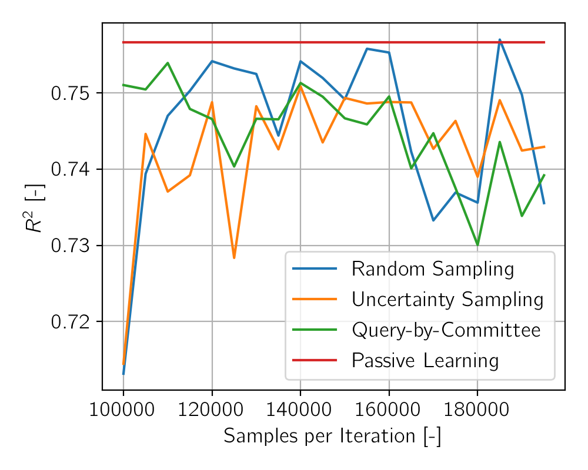

# DTU Summer School: Advanced Topics in Machine Learning and Human Cognition
Project:
ESTIMATION OF A VESSELS’ FUEL CONSUMPTION BY DEEP BAYESIAN ACTIVE LEARNING BASED ON IN-SITU MEASUREMENTS

Find data here: http://cogsys.imm.dtu.dk/propulsionmodelling/

